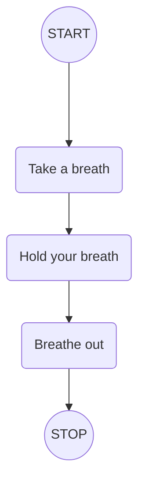

# Breathing

```mermaid
flowchart 
    start((START))
    stop((STOP))
    step0(Take a breath)
    step1(Hold your breath)
    start--->step0
    step0-->step1
    step1-->step2(Breathe out)
    step2-->stop
```